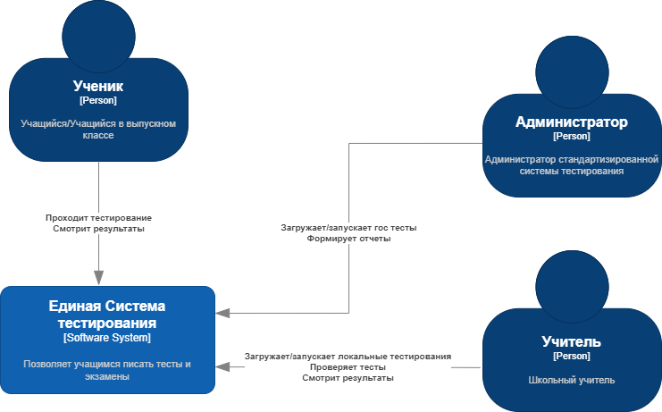
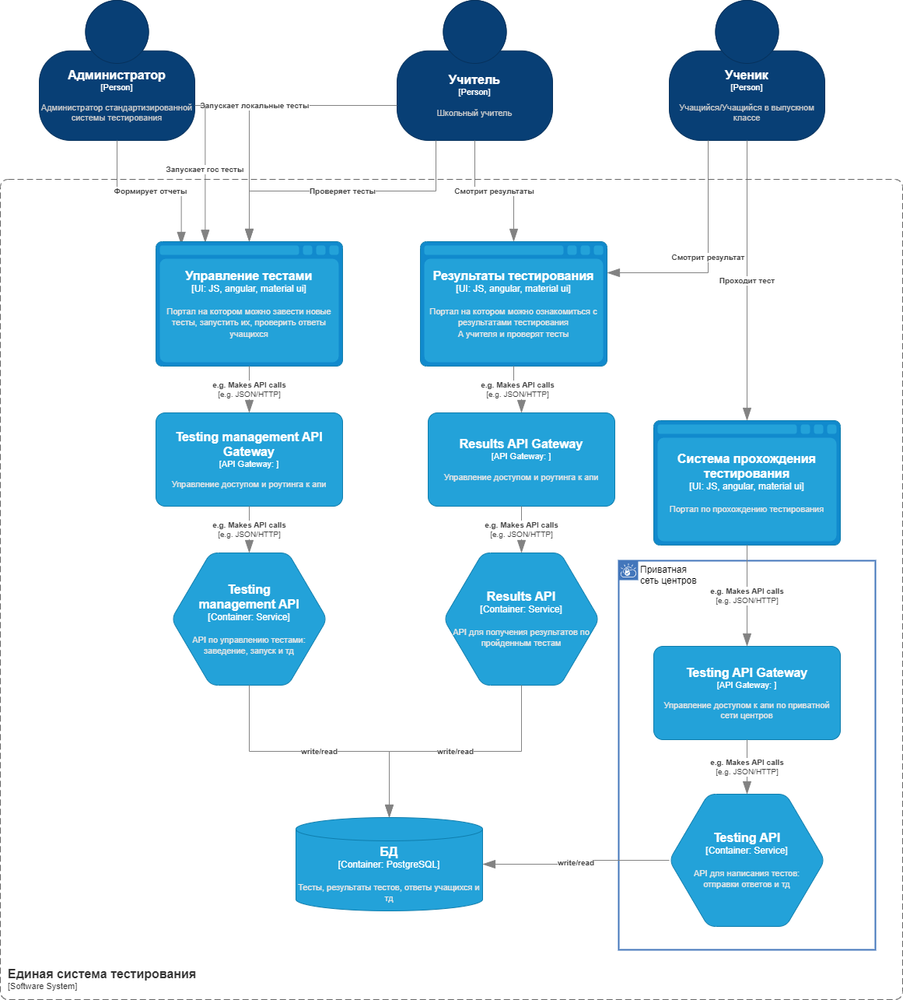

# Домашнее задание "Анализ требований и подготовка архитектурному решению"
## Задание

  
Описание задания

  - [x] Бизнес-контекст
  - [x] Бизнес-цели и бизнес-драйверы
  - [x] Стейкхолдеров и их потребности
  - [x] Пользовательские истории
  - [x] Атрибуты качества (и не функциональные требования)
  - [x] Изобразите контекстную схему системы
  - [x] Критические сценарии и критические характеристики
  - [x] 2 первых архитектурных решения запишите в виде ADR
  - [x] Сравнительная оценка альтернатив, и базовое решение
  - [x] Окончательное архитектурное решение оформите в виде ADR

## Кейс
[Make the grade](https://nealford.com/katas/kata?id=MakeTheGrade)

  
Описание каты

  A very large and populous state would like a new system to support standardized testing across all public school systems grades 3-12.

  - Users: 40,000+ students, 2000 graders, 50 administrators.
  - Requirements:
    - Students will only be able to use the application within testing centers around the state, most of these will be in the schools, but not all of them
    - Students should be able to take a test, and the results eventually consolidated to a single location representing all of the test scores across the state (by school, teacher, and student).
    - Tests will be multiple choice, short answer, and essay.
    - The system should have a reporting system to know which students have taken the tests and what score they received.
    - Short answer and essay questions will be manually graded by teachers, who will then add the essay grades to the system.
  - Additional Context:
    - A change approval processes involving three different government agencies is required for changes to the way student grades are kept to ensure security.
    - The state does not own its hosting center, but outsources it to a third party.
    - Project must defend its budget each fiscal year.

## ADR

### Make the grade

## Бизнес-контекст

Крупный и густонаселенный город хочет внедрить стандартизированную систему тестирования для все публичных школ для 4-11. Приложением должны пользоваться только в специальных центрах по тестированию (не все они будут располагаться в школах). Результаты тестирования должны быть доступны школе, учителю и учащемуся. Тесты могут состоять из выбора опции, короткий ответ или ессе. Короткий ответ и эссе проверяется учителями, после проверки результат вводится в систему. Также систему должна формировать отчет, чтобы узнать кто прошел тестирование и какие оценки получили. Хостинг системы передается 3-ей стороне. Проект должен защищать свой бюджет каждый финансовый год. При смене хранилища данныхпотребуется апрув от 3 гос агенств.

### Вопросы по бизнес-контексту и содержимому каты
#### По кате
- Предполагаю, что речь идет об РФ, сооответственно специфика заданий и тд берем по нашим тестам и экзаменам
#### Дополнительные преположения
- Дополнения по видам заданий. Виды тестов: регулярные тесты и контрольные, по описанным видам ответов, ВПР, ОГЭ и ЕГЭ. В связи с этим дополнительный вид задания аудирование.
- Администраторы настраивают и формируют отчеты, занимаются администрированием учетных записей, загрузкой общих гос тестов (ОГЭ, ЕГЭ)
- Согласно ФЗ по соц защите инвалидов, образовательные порталы дожны быть обладать доступным интерфейсом для всех групп учащихся. Интерфейс должен быть доступен для незрячих, маломобильных и других групп. Для такой системы это важная характеристика, если это не предусмотреть, может привести к штрафам и жалобам на учебные заведениям.
- Третья сторона для хостинга еще не выбрана, в праве сами предлагать варианты. Варианты должны быть из росреестра ПО

## Бизнес-цели и бизнес-драйверы

### Цель
Разработать систему для стандартизированного тестирования для всех учащихся и отчетности по прогрессу тестирования.

### Драйверы
- отсутствует единая система проведения тестирования учащихся
- отсутствует единая система просмотра результатов
- отсутствует система отчета о проведенных тестах

## Стейкхолдеры и их потребности

- <b> Учащиеся и выпускники </b>
  
  Проходят тесты в системе, заинтересованы в просмотре своих результатов

- <b> Учителя </b>

  Проверяют тесты и проверяют результаты тестирования, скорее всего еще могут иметь доступ к составлению самих тестов

- <b> Администраторы </b>

  Управляют формированием отчетов, загрузкой гос тестов в день гос экзаменов, администрирование учетных записейщт

- <b> Администрация школ </b>

  Заинтересованы в отчетах и возможности мониторинга за результатами своих учеников

- <b> Команда разработки </b>

## Пользовательские сценарии

### UC-1: Создание тестов

Заведение стандартизированных тестов в систему администраторами или учителями

### UC-2: Прохождение теста

Учащийся проходит тест под своей учетной записью, привязанной к школе, и отправляет свои ответы по завершению заданий.

### UC-3: Проверка тестов

Учитель проверяет ответы учащихся для заданий в виде короткого ответа или эссе, отправляет результирующую оценку в систему.

### UC-4: Просмотр результатов

Учащийся, школа и учитель могут смотреть результат теста ученика в системе

### UC-5: Формирование отчета

Администратор формирует отчет по прогрессу тестирования

## Атрибуты качества

- <b>Производительность</b>

  - система должна выдерживать нагрузку при максимальном количестве выпускников и учащихся во время написания тестов
  - приложение должно работать на компьютерах в центрах и школах
- <b>A11y</b>
 
  система должна быть совместима с асситивными устройствами, чтобы любой учащийся или выпускник из всех видов школ (включая 7 и 8 вид) мог пройти тестирование
- <b>Security</b>
  - доступ к части системы по прохождению теста должен быть доступен только из сети школы или центра по тестированию
  - способ хранения данных по оценкам учеников должен соответствовать требованиям по защите информации в государственных агенствах (зависит от ответа на вопрос)

- <b>Масштабируемость</b>

  - система должна машстабироваться под изменение бюджета (в случае неуспешной защиты бюджета) 
  - система должна масштабироваться в случае успешного применения в одном городе и расширении на другие города

## Критические сценарии и критические характеристики
### Критические сценарии
- Учащийся проходит тест
- Учитель проверяет тест
- Учащийся, учитель и школа видят результаты тестов
### Критические характеристики
- производительность системы: выдерживает нагрузку максимального количества учащихся, проходящих тестирование
- a11y: доступность интерфейса для учащихся
- безопасность: соответствие требованиям гос агенств и росреестр ПО
- стоимость разработки
- стоимость эксплуатации системы (защита бюджета)
- возможность модификции в случае урезания бюджета

## Контекстная диаграмма

## Выбор архитектурного стиля
Для дальнейшей детализации решения необходимо выбрать архитектурный подход

###  Драйверы
- возможность модификации в случае урезания бюджета
- бюджет

### Варианты подходов
- монолит
- микросервисы

### Сравнение подходов
- Монолит
  1. Бюджет - довольно низкая стоимость разработки
  2. Модификации в случае урезания бюджета - с монолитом не получится оптимизировать расходы, подобные разоды, т.к. не выйдет отключить какую-нибудь часть системы или использовать менее мощное железо для менее критичной части системы

- Микросервис
  1. Бюджет - стоимость разработки значительно выше монолита
  2. Для разных составляющих системы можно использовать разные режимы работы, разное железо и тд в зависимости от критичности пути, сэкономив на стоимости эксплуатации системы

### Принятое решение

Т.к. для системы помимо стоимости разработки еще важно защищать бюджет во время эксплуатации, то наиболее гибким вариантом будет использование микросервисной архитектуры, хоть стоимость и время разработки повышается.

## Выбор технологического стека для UI
###  Драйверы
- бюджет
- доступность интерфейса

### Варианты подходов
- react.js
- angular
- vue.js

### Сравнение подходов
- React.js
  1. Бюджет - среди всех разработчиков, в среднем реакт разработчик будет дороже ($$)
  2. Доступность - т.к. экосистема реакта уже очень развита, то имеется уже большое разнообразие компонентных библиотек, поддерживающих доступность. Аналогичная библиотека material ui с хорошим уровнем доступности на данный момент имеет очень большую часть платного содержимого, что может увеличить стоимость разработки (aa)

- Vue.js
  1. Бюджет ($)
  2. Доступность - экосистема этого фреймворка еще не так сильно развита и библотек с надлежащим уровнем а11у сильно меньше (а)

- Angular
  1. Бюджет ($)
  2. Доступность - экосистема фреймворк уже очень развита, в дополнение имеется наиболее серьезная библиотека, содержащая в себе не только доступные компоненты, но еще и широкий набор инструментов для поддержания а11у на глобальной уровне (material UI от разработчиков ангуляра) (ааа)

### Принятое решение

Т.к. помимо стоимости разработки важным атрибутом качества является а11у, то среди предложенных вариантов больше всего подойдет angular вместе с material UI. 

## Контейнеры

