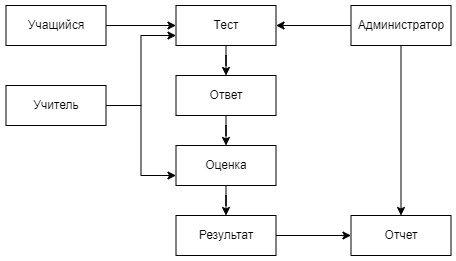
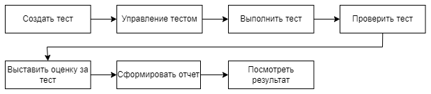
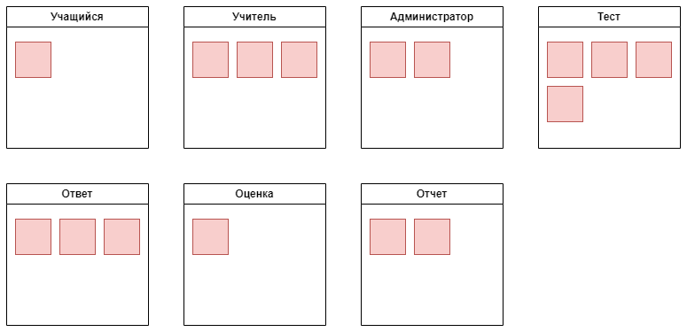
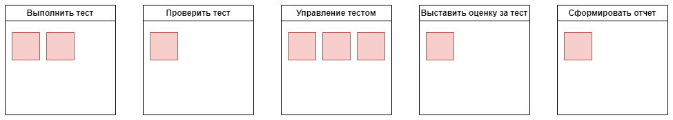

# Домашнее задание "Декомпозиция на функциональные компоненты"
## Задание

  
Описание задания

  Предложите как минимум 2 способа функциональной декомпозиции системы.
  Для каждого из решений проведите оценку модифицируемости, сравнительный анализ и вывод.
  В результате необходимо предоставить

- [] Модели предметной области и соответствующую функциональную декомпозицию
- [] Сценарии изменений с примерами (и возможно оценкой вероятности)
- [] Оценка стоимости изменений для каждого решения
- [] Сравнительный анализ и вывод

## Кейс
[Make the grade](https://nealford.com/katas/kata?id=MakeTheGrade)

  
Описание каты

  A very large and populous state would like a new system to support standardized testing across all public school systems grades 3-12.

  - Users: 40,000+ students, 2000 graders, 50 administrators.
  - Requirements:
    - Students will only be able to use the application within testing centers around the state, most of these will be in the schools, but not all of them
    - Students should be able to take a test, and the results eventually consolidated to a single location representing all of the test scores across the state (by school, teacher, and student).
    - Tests will be multiple choice, short answer, and essay.
    - The system should have a reporting system to know which students have taken the tests and what score they received.
    - Short answer and essay questions will be manually graded by teachers, who will then add the essay grades to the system.
  - Additional Context:
    - A change approval processes involving three different government agencies is required for changes to the way student grades are kept to ensure security.
    - The state does not own its hosting center, but outsources it to a third party.
    - Project must defend its budget each fiscal year.

## Функциональная декомпозиция

### Модели предметной области
#### Вариант №1

  - В этом случае можно выделить блоки из сущностей:
    - Учащийся
    - Учитель
    - Тест
    - Ответ
    - Оценка
    - Результат
    - Администратор
    - Отчет

#### Вариант №2

  - В этом случае можно выделить блоки из бизнес-контекста:
    - Создать тест
    - Управление тестом
    - Выполнить тест
    - Проверить тест
    - Выставить оценку за тест
    - Сформировать отчет
    - Посмотреть результаты

### Сценариии изменений

  Примеры:

    - Учащийся может добавить дополнительный материал к ответу на тест (файл)
    - Учитель может добавить комментарий к ответу ученика
    - Учитель может настраивать ограничения на тест
    - Администратор может массово приостанавлитьвать выполнение теста
    - Администратор может добавлять к тесту тэги для дальнейших группировок по отчетам
    - Учиталь может оставлять комментарии к оценке
    - На основании комментариев учителей к ответам и оценкам собирать статистику по проблемным темам
    - На этапе выполнения теста добавляется прокторинг(видеонаблюдение за выполняющим тест)

### Оценка стоимости изменений
#### Вариант №1

  Примеры:

    - Учащийся может добавить дополнительный материал к ответу на тест (файл) - (учащийся/ответ)
    - Учитель может добавить комментарий к ответу ученика - (учитель/ответ)
    - Учитель может настраивать ограничения на тест - (учитель/тест)
    - Администратор может массово приостанавлитьвать выполнение теста - (администратор/тест)
    - Администратор может добавлять к тесту тэги для дальнейших группировок по отчетам - (администратор/тест/отчет)
    - Учиталь может оставлять комментарии к оценке - (учитель/оценка)
    - На основании комментариев учителей к ответам и оценкам собирать статистику по проблемным темам - (ответ/оценка/отчет)
    - На этапе выполнения теста добавляется прокторинг(видеонаблюдение за выполняющим тест) - (тест)

#### Вариант №2

  Примеры:

    - Учащийся может добавить дополнительный материал к ответу на тест (файл) - (выполнить тест)
    - Учитель может добавить комментарий к ответу ученика - (проверить тест)
    - Учитель может настраивать ограничения на тест - (управление тестом)
    - Администратор может массово приостанавлитьвать выполнение теста - (управление тестом)
    - Администратор может добавлять к тесту тэги для дальнейших группировок по отчетам - (управление тестом)
    - Учиталь может оставлять комментарии к оценке - (Выставить оценку за тест)
    - На основании комментариев учителей к ответам и оценкам собирать статистику по проблемным темам - (Сформировать отчет)
    - На этапе выполнения теста добавляется прокторинг(видеонаблюдение за выполняющим тест) - (Выполнить тест)

### Сравнительный анализ

  В первом варианте при внесении изменений очень часто затрагиваются сразу несколько блоков, количество модифицируемых блоков равно 7, так же есть блоки сильно нагружунные изменениями.

  Во втором варианте внесение измененй затрагивает по одному блоку, количество модифицируемых блоков равно 5.

  Второй вариант предпочтительней, т.к. при модификации для каждого сценария затрагивается 1 блок, и нет сильно нагруженных блоков изменениями, так же количество изменений затрагивает меньше блоков, поэтому второй вариант является более машстабируемым и дешевым.