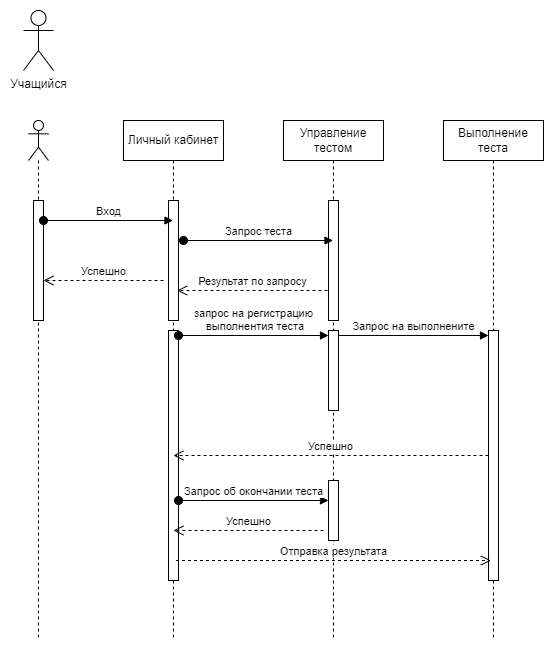

# Домашнее задание "Взаимодействие сервисов"
## Задание

  
Описание задания

  Необходимо описать взаимодействие нескольких сервисов и оценить архитектурное решение. Для критичного сценария

- [] Создать диаграмму последовательности (sequence diagram)
- [] Сделать оценку атрибутов качества (например, надежность, производительность, модифицируемость и т.д) с помощью конкретных сценариев и характеристик ИТ системы.

## Критичный сценарий
Учащийся проходит тест под своей учетной записью, привязанной к школе, и отправляет свои ответы по завершению заданий.
## Sequence diagram
Построена на основе функциональной декомпозиции и адр

## Оценка атрибутов качества
### АК: Масштабируемость
##### Критический сценарий
  - система должна машстабироваться под изменение бюджета (в случае неуспешной защиты бюджета)
  - система должна масштабироваться в случае успешного применения в одном городе и расширении на другие города

  На основании данного критического сценария можно подчеркнуть, что масштабируемость системы является важным атрибутом качества, так как она позволяет системе адаптироваться к изменению бюджета и расширению на другие города. Это может быть достигнуто через вертикальное, горизонтальное масштабирование или их комбинацию, в зависимости от требований и условий использования системы.

Например:
  - Вертикально - при увеличении нагрузки на сервер и добавление новых функций мы можем увеличить ресурсы конкретного сервера (CPU/RAM/HDD...)
  - Горизонтально - для обеспечения возможности расширения на новые города система может быть кластеризована, так как добавление новых городов и их школ будет осуществлятся посредствам добавление новых серверов в кластер, что является простым и эффективным решением.

Важно отметить, что выбор между вертикальным и горизонтальным масштабированием или их комбинацией должен основываться на анализе требований к системе, бюджете и удобстве обслуживания.

#### Плюсы и минусы
- Вертикальное масштабирование может быть дешевле и проще в обслуживании, но может ограничивать рост системы в долгосрочной перспективе.
- Горизонтальное масштабирование может потребовать больше инвестиций на начальном этапе, но оно может обеспечить большую гибкость и масштабируемость при расширении системы на другие города.

Вывод:
  В данном случае нам подходит комбинация вертикального и горизонтального масштабирования так как нам необходима возможность как увеличивать пропускную способность в отдельно взятой шлоке(городе) так и расширятся на новые. В случае неуспешной защиты бюджета так же нужна возможность ужимать систему (уберать из кластера сервера итд).

### АК: Производительность
##### Критический сценарий
  - система должна выдерживать нагрузку при максимальном количестве выпускников и учащихся во время написания тестов
  - приложение должно работать на компьютерах в центрах и школах

  Производительность системы является важным атрибутом качества в данном критическом сценарии. Система должна быть способна обрабатывать большой объем данных и запросов при максимальном количестве пользователей, а также обеспечивать стабильную работу.
  Это включает в себя оптимизацию производительности хранилища данных, стабильность сервисов обработки данных, а также сетевых взаимодействий. Кроме того, система должна быть масштабируемой, чтобы адаптироваться к изменению количества пользователей и рабочей нагрузки.