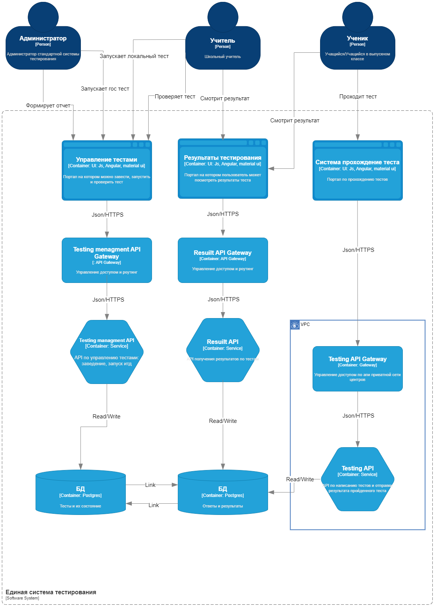
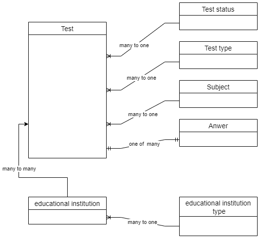
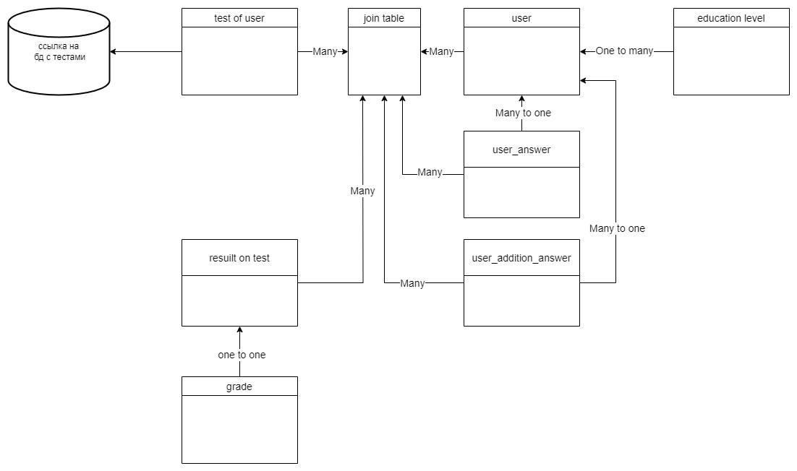
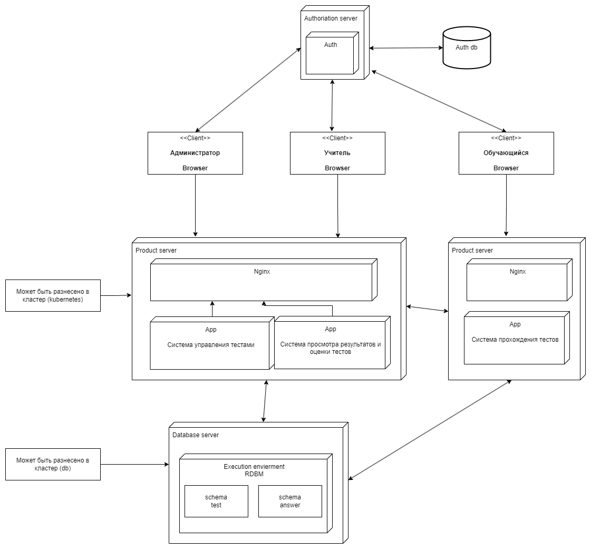

# Домашнее задание "Системное проектирование"
## Задание

  
Описание задания

  Для выбранного кейса опишите слой решения

- [] Диаграмма контейнеров приложения на основе выбранной модели функциональной декомпозиции
- [] Декомпозиция слоя данных: какие данные в каких БД хранятся
- [] Деплоймент диаграмма

## Диаграмма контенейров

## Декомпозиция данных
В данной системе будет использовать 2 базы даннх слинкованные между собов в качестве СУБД выбрана реалиционная Postgres.
Разнесение по разным схемам позволяет нам изолировать друг от друга разные БП.
Так же такая концепция легко масштабируется при увеличении бюджена и сужается при уменьшении (2 схемы в одном инстансе бд/ разненсение в кластер).

## Деплоймент диаграмма
